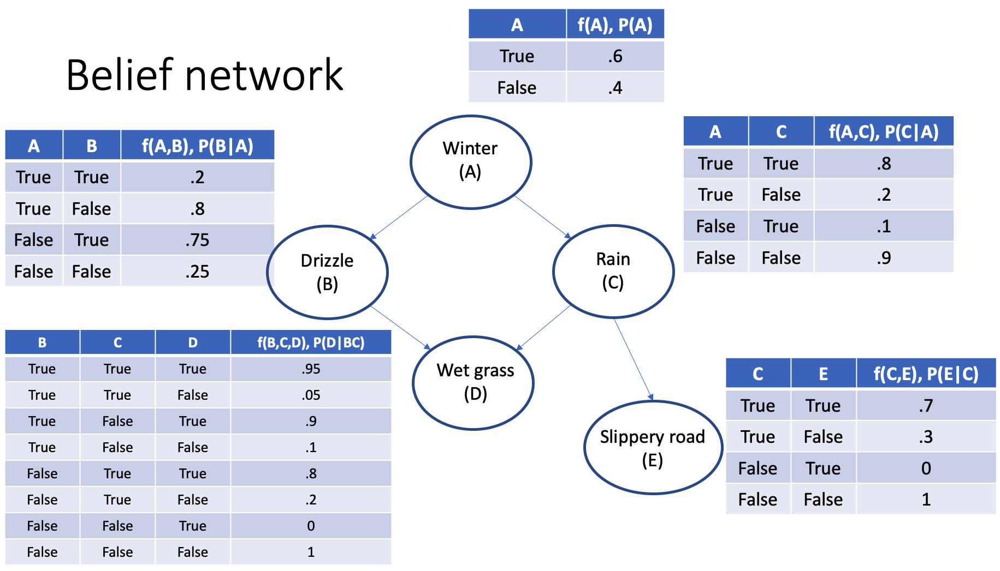
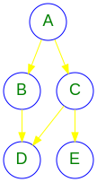

<!-- # Variable elimination algorithm -->

# An API for belief networks in python
## Implementing the *varaible elimination algorithm*

* Git clone this repository or download, unzip, and cd in this repository `Credal-Networks.zip`
* Open a new notebook in the same directory
* Add the follwing line at the beginning of the code

```python
from pyLib.elimination import BeliefNetwork
```


Let's consider the network in the figure below:



The network is created node by node using dictionaries as follows:

```python
A = {
    'ID':'A', # must be unique
    'Name':'Winter',
    'Description':'A longer description or comment',
    'Parents':[],
    'CPT':[0.6],
}
B = {
    'ID':'B',
    'Name':'Drizzle',
    'Description':'',
    'Parents':['A'],
    'CPT':[0.2,0.75],
}
C = {
    'ID':'C',
    'Name':'Rain',
    'Description':'',
    'Parents':['A'],
    'CPT':[0.8,0.1],  # C True
}
D = {
    'ID':'D',
    'Name':'Wet grass',
    'Description':'',
    'Parents':['B','C'],
    'CPT':[0.95,0.9,0.8,0.0], # D True
}
E = {
    'ID':'E',
    'Name':'Slippery road',
    'Description':'',
    'Parents':['C'],
    'CPT':[0.7,0.0],  # E True
}
```

The key `'Parent'` in the above node dictionaries define the architecture of the network.

The CPT values are those associated with the `True` states of the node variable. With more than two parents this may need additional specifications for the user.


```python
from pyLib.elimination import BeliefNetwork
```


```python
BN = BeliefNetwork(A,B,C,D,E)
```


```python
BN.displayGraph()
```





The joint probability distribution can be obtained multiplying at once all the factors associated with the CPT of each node.

`P(A, B, C, D, E) = P(A) * P(B|A) * P(C|A) * P(D|BC) * P(E|C)`

From the above joint distribution we any further query on the network can be performed. For example we could ask what is the marginal distribution P(E). This will be done by summing out all the variables except E from the joint P(A, B, C, D, E).


Because this network is small, the joint distribution can be explicitly displayed. The full joint distribution can be computed as follows:


```python
jointALL = BN.joint('A','B','C','D','E')
```


```python
jointALL.show()
```


<div>
<table border="1" class="dataframe">
  <thead>
    <tr style="text-align: right;">
      <th></th>
      <th>A</th>
      <th>B</th>
      <th>C</th>
      <th>D</th>
      <th>E</th>
      <th>f(A,B,C,D,E)</th>
    </tr>
  </thead>
  <tbody>
    <tr>
      <th>1</th>
      <td>True</td>
      <td>True</td>
      <td>True</td>
      <td>True</td>
      <td>True</td>
      <td>0.06384</td>
    </tr>
    <tr>
      <th>2</th>
      <td>True</td>
      <td>True</td>
      <td>True</td>
      <td>True</td>
      <td>False</td>
      <td>0.02736</td>
    </tr>
    <tr>
      <th>3</th>
      <td>True</td>
      <td>True</td>
      <td>True</td>
      <td>False</td>
      <td>True</td>
      <td>0.00336</td>
    </tr>
    <tr>
      <th>4</th>
      <td>True</td>
      <td>True</td>
      <td>True</td>
      <td>False</td>
      <td>False</td>
      <td>0.00144</td>
    </tr>
    <tr>
      <th>5</th>
      <td>True</td>
      <td>True</td>
      <td>False</td>
      <td>True</td>
      <td>True</td>
      <td>0.00000</td>
    </tr>
    <tr>
      <th>6</th>
      <td>True</td>
      <td>True</td>
      <td>False</td>
      <td>True</td>
      <td>False</td>
      <td>0.02160</td>
    </tr>
    <tr>
      <th>7</th>
      <td>True</td>
      <td>True</td>
      <td>False</td>
      <td>False</td>
      <td>True</td>
      <td>0.00000</td>
    </tr>
    <tr>
      <th>8</th>
      <td>True</td>
      <td>True</td>
      <td>False</td>
      <td>False</td>
      <td>False</td>
      <td>0.00240</td>
    </tr>
    <tr>
      <th>9</th>
      <td>True</td>
      <td>False</td>
      <td>True</td>
      <td>True</td>
      <td>True</td>
      <td>0.21504</td>
    </tr>
    <tr>
      <th>10</th>
      <td>True</td>
      <td>False</td>
      <td>True</td>
      <td>True</td>
      <td>False</td>
      <td>0.09216</td>
    </tr>
    <tr>
      <th>11</th>
      <td>True</td>
      <td>False</td>
      <td>True</td>
      <td>False</td>
      <td>True</td>
      <td>0.05376</td>
    </tr>
    <tr>
      <th>12</th>
      <td>True</td>
      <td>False</td>
      <td>True</td>
      <td>False</td>
      <td>False</td>
      <td>0.02304</td>
    </tr>
    <tr>
      <th>13</th>
      <td>True</td>
      <td>False</td>
      <td>False</td>
      <td>True</td>
      <td>True</td>
      <td>0.00000</td>
    </tr>
    <tr>
      <th>14</th>
      <td>True</td>
      <td>False</td>
      <td>False</td>
      <td>True</td>
      <td>False</td>
      <td>0.00000</td>
    </tr>
    <tr>
      <th>15</th>
      <td>True</td>
      <td>False</td>
      <td>False</td>
      <td>False</td>
      <td>True</td>
      <td>0.00000</td>
    </tr>
    <tr>
      <th>16</th>
      <td>True</td>
      <td>False</td>
      <td>False</td>
      <td>False</td>
      <td>False</td>
      <td>0.09600</td>
    </tr>
    <tr>
      <th>17</th>
      <td>False</td>
      <td>True</td>
      <td>True</td>
      <td>True</td>
      <td>True</td>
      <td>0.01995</td>
    </tr>
    <tr>
      <th>18</th>
      <td>False</td>
      <td>True</td>
      <td>True</td>
      <td>True</td>
      <td>False</td>
      <td>0.00855</td>
    </tr>
    <tr>
      <th>19</th>
      <td>False</td>
      <td>True</td>
      <td>True</td>
      <td>False</td>
      <td>True</td>
      <td>0.00105</td>
    </tr>
    <tr>
      <th>20</th>
      <td>False</td>
      <td>True</td>
      <td>True</td>
      <td>False</td>
      <td>False</td>
      <td>0.00045</td>
    </tr>
    <tr>
      <th>21</th>
      <td>False</td>
      <td>True</td>
      <td>False</td>
      <td>True</td>
      <td>True</td>
      <td>0.00000</td>
    </tr>
    <tr>
      <th>22</th>
      <td>False</td>
      <td>True</td>
      <td>False</td>
      <td>True</td>
      <td>False</td>
      <td>0.24300</td>
    </tr>
    <tr>
      <th>23</th>
      <td>False</td>
      <td>True</td>
      <td>False</td>
      <td>False</td>
      <td>True</td>
      <td>0.00000</td>
    </tr>
    <tr>
      <th>24</th>
      <td>False</td>
      <td>True</td>
      <td>False</td>
      <td>False</td>
      <td>False</td>
      <td>0.02700</td>
    </tr>
    <tr>
      <th>25</th>
      <td>False</td>
      <td>False</td>
      <td>True</td>
      <td>True</td>
      <td>True</td>
      <td>0.00560</td>
    </tr>
    <tr>
      <th>26</th>
      <td>False</td>
      <td>False</td>
      <td>True</td>
      <td>True</td>
      <td>False</td>
      <td>0.00240</td>
    </tr>
    <tr>
      <th>27</th>
      <td>False</td>
      <td>False</td>
      <td>True</td>
      <td>False</td>
      <td>True</td>
      <td>0.00140</td>
    </tr>
    <tr>
      <th>28</th>
      <td>False</td>
      <td>False</td>
      <td>True</td>
      <td>False</td>
      <td>False</td>
      <td>0.00060</td>
    </tr>
    <tr>
      <th>29</th>
      <td>False</td>
      <td>False</td>
      <td>False</td>
      <td>True</td>
      <td>True</td>
      <td>0.00000</td>
    </tr>
    <tr>
      <th>30</th>
      <td>False</td>
      <td>False</td>
      <td>False</td>
      <td>True</td>
      <td>False</td>
      <td>0.00000</td>
    </tr>
    <tr>
      <th>31</th>
      <td>False</td>
      <td>False</td>
      <td>False</td>
      <td>False</td>
      <td>True</td>
      <td>0.00000</td>
    </tr>
    <tr>
      <th>32</th>
      <td>False</td>
      <td>False</td>
      <td>False</td>
      <td>False</td>
      <td>False</td>
      <td>0.09000</td>
    </tr>
  </tbody>
</table>
</div>


We can apply the elimination algorithm directly to the joint and obtain the specific marginals or conditional probabilities.

For example we could ask for the joint probability `P(D,E)`, which can be obtained by summing out all of the variables not included in the query, i.e. `'A'`, `'B'`, `'C'`. The API has a method called `sumout` to perform this task.


```python
(((jointALL.sumout('A')).sumout('B')).sumout('C')).show()
```


<div>
<table border="1" class="dataframe">
  <thead>
    <tr style="text-align: right;">
      <th></th>
      <th>D</th>
      <th>E</th>
      <th>f(D,E)</th>
    </tr>
  </thead>
  <tbody>
    <tr>
      <th>1</th>
      <td>True</td>
      <td>True</td>
      <td>0.30443</td>
    </tr>
    <tr>
      <th>2</th>
      <td>True</td>
      <td>False</td>
      <td>0.39507</td>
    </tr>
    <tr>
      <th>3</th>
      <td>False</td>
      <td>True</td>
      <td>0.05957</td>
    </tr>
    <tr>
      <th>4</th>
      <td>False</td>
      <td>False</td>
      <td>0.24093</td>
    </tr>
  </tbody>
</table>
</div>


Obtaining the joint `P(D,E)` is not very efficient in this way. This is because the full joint probability is the largest factor that appear in the network.

So we can obtain the same result in a more efficient way, deploying the *Variable Elimination* algorithm. This is becuase the VE algorithm looks for the combination of factors that minimizes the size of factors involved and therefore the number of arithmetic operations.

The API performs this task automatically using the following syntax:


```python
BN.joint('D','E').show()
```


<div>
<table border="1" class="dataframe">
  <thead>
    <tr style="text-align: right;">
      <th></th>
      <th>E</th>
      <th>D</th>
      <th>f(E,D)</th>
    </tr>
  </thead>
  <tbody>
    <tr>
      <th>1</th>
      <td>True</td>
      <td>True</td>
      <td>0.30443</td>
    </tr>
    <tr>
      <th>2</th>
      <td>True</td>
      <td>False</td>
      <td>0.05957</td>
    </tr>
    <tr>
      <th>3</th>
      <td>False</td>
      <td>True</td>
      <td>0.39507</td>
    </tr>
    <tr>
      <th>4</th>
      <td>False</td>
      <td>False</td>
      <td>0.24093</td>
    </tr>
  </tbody>
</table>
</div>


Alternatively the same query can be invoked with some more syntactic sugar as follwos:


```python
(BN.n['D'] & BN.n['E']).show()
```


<div>
<table border="1" class="dataframe">
  <thead>
    <tr style="text-align: right;">
      <th></th>
      <th>E</th>
      <th>D</th>
      <th>f(E,D)</th>
    </tr>
  </thead>
  <tbody>
    <tr>
      <th>1</th>
      <td>True</td>
      <td>True</td>
      <td>0.30443</td>
    </tr>
    <tr>
      <th>2</th>
      <td>True</td>
      <td>False</td>
      <td>0.05957</td>
    </tr>
    <tr>
      <th>3</th>
      <td>False</td>
      <td>True</td>
      <td>0.39507</td>
    </tr>
    <tr>
      <th>4</th>
      <td>False</td>
      <td>False</td>
      <td>0.24093</td>
    </tr>
  </tbody>
</table>
</div>


What has the elimination algorithm done to get this result?

It has gone through all of the permuations of the set `{'A','C','B'}` and has selected the most efficient combination of these variables, which in this case happens to be `['A','B','C']`. This combination means that the algorithm sumout variable `'A'` first, so (1) it looks for all the CPTs that contain the variable A, (2) performs *factor multiplication* between them, and (3) sum out variable A from the resulting factor.

factor_with_A := `P(A) * P(B|A) * P(C|A)`

Let's follow this process step by step.

1. Collect all the CPTs where A appears:


```python
BN.f['A']  # P(A)
```


    ('A',): f(A)
    (True,): 0.6
    (False,): 0.4


```python
BN.f['B']  # P(B|A)
```


    ('B', 'A'): f(B,A)
    (True, True): 0.2
    (True, False): 0.75
    (False, True): 0.8
    (False, False): 0.25


```python
BN.f['C']  # P(C|A)
```


    ('C', 'A'): f(C,A)
    (True, True): 0.8
    (True, False): 0.1
    (False, True): 0.19999999999999996
    (False, False): 0.9


2. Perform factor multiplication between them:

The API implements the factor multiplication.


```python
(BN.f['A'] * BN.f['B'] * BN.f['C']).show()
```


<div>
<table border="1" class="dataframe">
  <thead>
    <tr style="text-align: right;">
      <th></th>
      <th>A</th>
      <th>B</th>
      <th>C</th>
      <th>f(A,B,C)</th>
    </tr>
  </thead>
  <tbody>
    <tr>
      <th>1</th>
      <td>True</td>
      <td>True</td>
      <td>True</td>
      <td>0.096</td>
    </tr>
    <tr>
      <th>2</th>
      <td>True</td>
      <td>True</td>
      <td>False</td>
      <td>0.024</td>
    </tr>
    <tr>
      <th>3</th>
      <td>True</td>
      <td>False</td>
      <td>True</td>
      <td>0.384</td>
    </tr>
    <tr>
      <th>4</th>
      <td>True</td>
      <td>False</td>
      <td>False</td>
      <td>0.096</td>
    </tr>
    <tr>
      <th>5</th>
      <td>False</td>
      <td>True</td>
      <td>True</td>
      <td>0.030</td>
    </tr>
    <tr>
      <th>6</th>
      <td>False</td>
      <td>True</td>
      <td>False</td>
      <td>0.270</td>
    </tr>
    <tr>
      <th>7</th>
      <td>False</td>
      <td>False</td>
      <td>True</td>
      <td>0.010</td>
    </tr>
    <tr>
      <th>8</th>
      <td>False</td>
      <td>False</td>
      <td>False</td>
      <td>0.090</td>
    </tr>
  </tbody>
</table>
</div>


2. Ultimately variable A is eliminated:


```python
(BN.f['A'] * BN.f['B'] * BN.f['C']).sumout('A').show()
```


<div>
<table border="1" class="dataframe">
  <thead>
    <tr style="text-align: right;">
      <th></th>
      <th>B</th>
      <th>C</th>
      <th>f(B,C)</th>
    </tr>
  </thead>
  <tbody>
    <tr>
      <th>1</th>
      <td>True</td>
      <td>True</td>
      <td>0.126</td>
    </tr>
    <tr>
      <th>2</th>
      <td>True</td>
      <td>False</td>
      <td>0.294</td>
    </tr>
    <tr>
      <th>3</th>
      <td>False</td>
      <td>True</td>
      <td>0.394</td>
    </tr>
    <tr>
      <th>4</th>
      <td>False</td>
      <td>False</td>
      <td>0.186</td>
    </tr>
  </tbody>
</table>
</div>


We are left with the following factors:

`f(B,C) * P(D|BC) * P(E|C)`

Which clearly has no reference to the variable A.

We can now repeat this process for variable B and C. Noticing that:

```python
BN.f['D'] # P(D|BC)
BN.f['E'] # P(E|C)
```

Elimination of variable B:


```python
fBC = (BN.f['A'] * BN.f['B'] * BN.f['C']).sumout('A')

((fBC * BN.f['D'] * BN.f['E']).sumout('B')).show()
```


<div>
<table border="1" class="dataframe">
  <thead>
    <tr style="text-align: right;">
      <th></th>
      <th>C</th>
      <th>D</th>
      <th>E</th>
      <th>f(C,D,E)</th>
    </tr>
  </thead>
  <tbody>
    <tr>
      <th>1</th>
      <td>True</td>
      <td>True</td>
      <td>True</td>
      <td>0.30443</td>
    </tr>
    <tr>
      <th>2</th>
      <td>True</td>
      <td>True</td>
      <td>False</td>
      <td>0.13047</td>
    </tr>
    <tr>
      <th>3</th>
      <td>True</td>
      <td>False</td>
      <td>True</td>
      <td>0.05957</td>
    </tr>
    <tr>
      <th>4</th>
      <td>True</td>
      <td>False</td>
      <td>False</td>
      <td>0.02553</td>
    </tr>
    <tr>
      <th>5</th>
      <td>False</td>
      <td>True</td>
      <td>True</td>
      <td>0.00000</td>
    </tr>
    <tr>
      <th>6</th>
      <td>False</td>
      <td>True</td>
      <td>False</td>
      <td>0.26460</td>
    </tr>
    <tr>
      <th>7</th>
      <td>False</td>
      <td>False</td>
      <td>True</td>
      <td>0.00000</td>
    </tr>
    <tr>
      <th>8</th>
      <td>False</td>
      <td>False</td>
      <td>False</td>
      <td>0.21540</td>
    </tr>
  </tbody>
</table>
</div>


Elimination of variable C:


```python
fCDE = (fBC * BN.f['D'] * BN.f['E']).sumout('B')
```

Because there are no more factors, this will just require the marginalization of C.


```python
(fCDE.sumout('C')).show()
```


<div>
<table border="1" class="dataframe">
  <thead>
    <tr style="text-align: right;">
      <th></th>
      <th>D</th>
      <th>E</th>
      <th>f(D,E)</th>
    </tr>
  </thead>
  <tbody>
    <tr>
      <th>1</th>
      <td>True</td>
      <td>True</td>
      <td>0.30443</td>
    </tr>
    <tr>
      <th>2</th>
      <td>True</td>
      <td>False</td>
      <td>0.39507</td>
    </tr>
    <tr>
      <th>3</th>
      <td>False</td>
      <td>True</td>
      <td>0.05957</td>
    </tr>
    <tr>
      <th>4</th>
      <td>False</td>
      <td>False</td>
      <td>0.24093</td>
    </tr>
  </tbody>
</table>
</div>


## Conditional probability

Now we want to obtain the conditional probability `P(E|D)`.

This is not a trivial task, but can be done by normailizing the above factor with respect to E.  In this way learning the state of D will leave us with a probability mass for E.

The API performs this task in a friendly way


```python
fDE = fCDE.sumout('C')
```


```python
(fDE.normalize('E')).show()
```


<div>
<table border="1" class="dataframe">
  <thead>
    <tr style="text-align: right;">
      <th></th>
      <th>D</th>
      <th>E</th>
      <th>f(D,E)</th>
    </tr>
  </thead>
  <tbody>
    <tr>
      <th>1</th>
      <td>True</td>
      <td>True</td>
      <td>0.435211</td>
    </tr>
    <tr>
      <th>2</th>
      <td>True</td>
      <td>False</td>
      <td>0.564789</td>
    </tr>
    <tr>
      <th>3</th>
      <td>False</td>
      <td>True</td>
      <td>0.198236</td>
    </tr>
    <tr>
      <th>4</th>
      <td>False</td>
      <td>False</td>
      <td>0.801764</td>
    </tr>
  </tbody>
</table>
</div>


The same result can be achived using--in a more Bayesian way--factor division after having computed the marginal distribution of D, in line with the formula:

`P(E|D) = P(D,E) / P(D)`


```python
fD = BN.marginal('D')
```


```python
(fDE / fD).show()
```


<div>
<table border="1" class="dataframe">
  <thead>
    <tr style="text-align: right;">
      <th></th>
      <th>D</th>
      <th>E</th>
      <th>f(D,E)</th>
    </tr>
  </thead>
  <tbody>
    <tr>
      <th>1</th>
      <td>True</td>
      <td>True</td>
      <td>0.435211</td>
    </tr>
    <tr>
      <th>2</th>
      <td>True</td>
      <td>False</td>
      <td>0.564789</td>
    </tr>
    <tr>
      <th>3</th>
      <td>False</td>
      <td>True</td>
      <td>0.198236</td>
    </tr>
    <tr>
      <th>4</th>
      <td>False</td>
      <td>False</td>
      <td>0.801764</td>
    </tr>
  </tbody>
</table>
</div>


The API provides a direct access to conditional probability in two ways:

1. using the method `query`.


```python
(BN.query('E', given=['D'])).show()
```


<div>
<table border="1" class="dataframe">
  <thead>
    <tr style="text-align: right;">
      <th></th>
      <th>D</th>
      <th>E</th>
      <th>f(D,E)</th>
    </tr>
  </thead>
  <tbody>
    <tr>
      <th>1</th>
      <td>True</td>
      <td>True</td>
      <td>0.435211</td>
    </tr>
    <tr>
      <th>2</th>
      <td>True</td>
      <td>False</td>
      <td>0.564789</td>
    </tr>
    <tr>
      <th>3</th>
      <td>False</td>
      <td>True</td>
      <td>0.198236</td>
    </tr>
    <tr>
      <th>4</th>
      <td>False</td>
      <td>False</td>
      <td>0.801764</td>
    </tr>
  </tbody>
</table>
</div>


2. using the `or` operator to reflect the well-known notation.


```python
(BN.n['E'] | [BN.n['D']]).show()
```


<div>
<table border="1" class="dataframe">
  <thead>
    <tr style="text-align: right;">
      <th></th>
      <th>D</th>
      <th>E</th>
      <th>f(D,E)</th>
    </tr>
  </thead>
  <tbody>
    <tr>
      <th>1</th>
      <td>True</td>
      <td>True</td>
      <td>0.435211</td>
    </tr>
    <tr>
      <th>2</th>
      <td>True</td>
      <td>False</td>
      <td>0.564789</td>
    </tr>
    <tr>
      <th>3</th>
      <td>False</td>
      <td>True</td>
      <td>0.198236</td>
    </tr>
    <tr>
      <th>4</th>
      <td>False</td>
      <td>False</td>
      <td>0.801764</td>
    </tr>
  </tbody>
</table>
</div>


The API enables also more complex queries, i.e. involving multiple variables:

For example `P(E|C,D)`


```python
(BN.n['E'] | [BN.n['D'],BN.n['C']]).show()
```


<div>
<table border="1" class="dataframe">
  <thead>
    <tr style="text-align: right;">
      <th></th>
      <th>D</th>
      <th>C</th>
      <th>E</th>
      <th>f(D,C,E)</th>
    </tr>
  </thead>
  <tbody>
    <tr>
      <th>1</th>
      <td>True</td>
      <td>True</td>
      <td>True</td>
      <td>0.7</td>
    </tr>
    <tr>
      <th>2</th>
      <td>True</td>
      <td>True</td>
      <td>False</td>
      <td>0.3</td>
    </tr>
    <tr>
      <th>3</th>
      <td>True</td>
      <td>False</td>
      <td>True</td>
      <td>0.0</td>
    </tr>
    <tr>
      <th>4</th>
      <td>True</td>
      <td>False</td>
      <td>False</td>
      <td>1.0</td>
    </tr>
    <tr>
      <th>5</th>
      <td>False</td>
      <td>True</td>
      <td>True</td>
      <td>0.7</td>
    </tr>
    <tr>
      <th>6</th>
      <td>False</td>
      <td>True</td>
      <td>False</td>
      <td>0.3</td>
    </tr>
    <tr>
      <th>7</th>
      <td>False</td>
      <td>False</td>
      <td>True</td>
      <td>0.0</td>
    </tr>
    <tr>
      <th>8</th>
      <td>False</td>
      <td>False</td>
      <td>False</td>
      <td>1.0</td>
    </tr>
  </tbody>
</table>
</div>


```python

```
